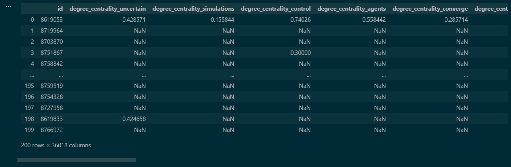

# Coherence and Cohesion Analysis of AI-generated Text: A Complex Network Approach

> ## Abstract

We intend to empirically evaluate and validate the SLIC metric in comparison to existing text quality assessment indices such as TAACO and Coh-Metrix, which do not use graph-theoretic measures, using the CHEAT dataset. Moreover, we intend to explore additional network measures, like clustering coefficients, coreness, and the shortest distance between nodes, to potentially develop a more comprehensive metric for assessing text quality. We aim to validate the additional metrics using the CHEAT dataset alongside established measures, ultimately enhancing our understanding of text cohesion (and conversely, lack thereof) and quality assessment. Can we find some similarities when evaluating text generated using other LLMs and similar differences to human-written text? Can we validate that the core of the network are the key-entities?

[Read more](https://docs.google.com/document/d/196-WPUO1FrbzzSTU2aF6EmKQQr_xYXO6B3dKUo8tcq0/edit)

> ## Dataset

Using [CHEAT: A Large-scale Dataset for Detecting CHatGPT-writtEn AbsTracts](https://github.com/botianzhe/CHEAT)

- Human written abstracts in [`ieee-init.jsonl`](/data/ieee-init.jsonl) and [`ieee-init.xlsx`](/data/ieee-init.xlsx)
- ChatGPT generated abstract in [`ieee-chatgpt-generation.jsonl`](/data/ieee-chatgpt-generation.jsonl) and [`ieee-chatgpt-generation.xlsx`](/data/ieee-chatgpt-generation.xlsx)
- ChatGPT refctored abstract in [`ieee-chatgpt-polish.jsonl`](/data/ieee-chatgpt-polish.jsonl) and [`ieee-chatgpt-polish.xlsx`](/data/ieee-chatgpt-polish.xlsx)
- Human AI fusion abstract in [`ieee-chatgpt-fusion.jsonl`](/data/ieee-chatgpt-fusion.jsonl) and [`ieee-chatgpt-fusion.xlsx`](/data/ieee-chatgpt-fusion.xlsx)

> ## How to use?

- Clone repo using `git clone https://github.com/JaideepDUCS/CHEAT-A-Network-Analysis.git`
- Open [`src/sampling.ipynb`](src/sampling.ipynb) > Run All
- Open TAACO tool. Select input folder as `taaco/inputs`, select output folder as `taaco/outputs`

- Click `Process Texts` and wait for completion.
- Open `taaco/outputs/results.csv` for results.

> ## Topological Analysis

Metrics used:

- [`nx.degree_centrality(G)`](/docs/metrics.md#degree-centrality) : Degree centrality is a measure of the importance of a node in a graph.   
   It is defined as the number of links incident upon a node (i.e., the number of ties that a node has)   
   Formula: `C_D(v) = d_v / (n - 1)`
- [`nx.eigenvector_centrality_numpy(G)`](/docs/metrics.md#eigenvector-centrality) : Eigenvector centrality is another measure of the importance of a node in a graph.   
   It is based on the idea that a node is important if it is connected to other important nodes.   
   Formula: `C_E(v) = (1 / λ) * ∑ C_E(u) ∀ (u,v) ∈ E`
- [`nx.closeness_centrality(G)`](/docs/metrics.md#closeness-centrality) : Closeness centrality is a measure of centrality in a network, which is calculated as the sum of the length of   the shortest paths between a node and all other nodes in the graph.   
   In other words, it measures how close a node is to all other nodes in the network.
- [`nx.closeness_vitality(G)`](/docs/metrics.md#closeness-vitality) : Closeness vitality is a measure of the importance of a node in a graph.   
   It is defined as the change in the sum of distances between all node pairs when excluding that node.   
   Formula: `C_V(v) = W - W(v)`
- [`nx.betweenness_centrality(G)`](/docs/metrics.md#betweenness-centrality) : Betweenness centrality is a measure of centrality in a network, which is calculated based on shortest paths between nodes.   
   It measures the extent to which a node lies on the shortest path between other nodes in the network.   
   Formula: `C_B​(v) = ∑ s != v != t σ_st(v)/σ_st`
- [`nx.edge_load_centrality(G)`](/docs/metrics.md#edge-load-centrality) : Edge load centrality is a concept in graph theory that measures the importance of an edge based on the number of shortest paths that pass through it.   
   Formula: `C_L​(e) = ∑ s != t ∊ V σ_st(e)/σ_st`
- [`nx.all_pairs_node_connectivity(G)`](/docs/metrics.md#all-pairs-node-connectivity) : All pairs node connectivity is a concept in graph theory that measures the minimum number of nodes that must be removed to disconnect all pairs of nodes in a graph. It is also known as global node connectivity.
- [`nx.average_neighbor_degree(G)`](/docs/metrics.md#average-neighbor-degree) : Average neighbor degree is a concept in graph theory that measures the average degree of the neighborhood of each node in a graph. It is defined as the average degree of the nodes that are connected to a given node by an edge.
- [`nx.average_degree_connectivity(G)`](/docs/metrics.md#average-degree-connectivity) : The average degree connectivity in a graph is the average nearest neighbor degree of nodes with degree k.
- [`nx.clustering(G)`](/docs/metrics.md#clustering) : Clustering in graph theory is a measure of the degree to which nodes in a graph tend to cluster together.   
   The clustering coefficient is a measure of the density of triangles in a graph.   
   The global clustering coefficient is based on triplets of nodes, while the local clustering coefficient is based on the neighborhood of a vertex.
- [`nx.degree_assortativity_coefficient(G)`](/docs/metrics.md#degree-assortativity-coefficient) : The degree assortativity coefficient is a measure of the similarity of connections in the graph with respect to the node degree.   
   It is a Pearson correlation coefficient of node degree between pairs of connected nodes, ranging from -1 to 1.   
   A positive assortativity coefficient indicates that nodes tend to connect to other nodes with the same or similar degree, while a negative assortativity coefficient indicates that nodes tend to connect to nodes with different degrees.
- [`nx.degree_pearson_correlation_coefficient(G)`](/docs/metrics.md#degree-pearson-correlation-coefficient) : The degree Pearson correlation coefficient in a graph, also known as the degree assortativity coefficient, is a measure of the correlation between the degrees of all pairs of nodes connected by an edge.
- [`nx.average_clustering(G)`](/docs/metrics.md#average-clustering) : The average clustering coefficient of a graph is a measure of the degree to which nodes in a graph tend to cluster together.   
   It is defined as the average of the local clustering coefficients of all nodes in the graph.   
   Formula: `C_avg L = 1/|V| . ∑ C_L(u)`
- [`nx.check_planarity(G)[0]`](/docs/metrics.md#planarity) : Planarity in graphs refers to the property of a graph that can be drawn on a plane without any edges crossing each other.  
   Formula: `v - e + f = 2`

For more details see [`docs/metrics.md`](docs/metrics.md).

>## Dataset Generation

Initial Dataset generated:

Shape of dataset: `200 rows x 348058 columns`

Final Dataset generated:

Shape of dataset: `200 rows x 36018 columns`

See timeline of work and challenges faced [here](https://docs.google.com/document/u/1/d/1rqsRAMKwK_jDQ4uskjvIxa1lp7IWrUrM062GIQU2Tjg/edit?pli=1).

>## Preprocessing

Original Dataset:

`Shape: 200 rows x 36018 columns`

Operations performed:
- `NaN` values removal

New Dataset:

`Shape: 200 rows x 13 columns`

>## Classification

Classifiers used:
- `MLPClassifier`: Basic Multi Level Perceptron model

Techniques used:
- `PCA`: For feature reduction

Using Full Dataset of 100 abstracts:
- 10 fold Cross Validation
  - 
  - 
- 80-20 Train Test Split
  - 

Using PCA for 2-13 features:
- 

> ## Contributors:

- Sudipto Ghosh
- Neeti Wason
- Srishty Sonal
- Jaideep Shekhar

> ## Acknowledgements:

- Prof. Vasudha Bhatnagar
- Prof. Sanjay Jain
